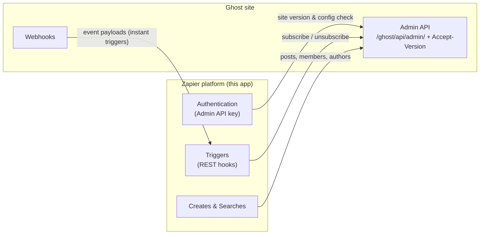

# Ghost-Zapier

The official [Ghost integration on Zapier](https://zapier.com/apps/ghost) — a
Zapier Platform CLI app that provides Ghost triggers, creates, and searches
backed by the Ghost Admin API.

## What it does

Zapier users connect their Ghost site with an Admin API key and URL (from
Ghost Admin under `Integrations » Zapier`) and build Zaps from:

- **Triggers** — instant REST hooks fed by Ghost webhooks: post/page
  published, post scheduled, member created/updated/deleted, tag, author,
  newsletter, and tier created
- **Creates** — create a post, create or update a member
- **Searches** — find a member or an author

All requests target the unversioned Admin API (`/ghost/api/admin/`) and
declare their compatibility version via the `Accept-Version` header.

## How it works

Triggers are instant: on Zap activation the app registers a webhook in Ghost,
and Ghost pushes event payloads to Zapier from then on. Creates and searches
call the Admin API directly.



## Ghost version support

New Zap connections require **Ghost 6.0 or later**. Authentication reads
`/ghost/api/admin/site/` and checks the reported version against the
supported range — single-sourced as `SUPPORTED_GHOST_VERSION` in
[`app/lib/utils.js`](app/lib/utils.js), alongside the `Accept-Version` value.
Review it when a new major version of Ghost is released.

Sites on older Ghost versions keep working: existing Zaps stay pinned to the
previously published integration versions they were created with (Zapier does
not migrate Zaps across integration major versions) — they just cannot make
new connections through the current version.

## Getting started

The app runs on `zapier-platform-core` v19, which uses Zapier's Node.js 22
Lambda runtime — use Node 22 locally (there is a `.nvmrc` if you have `nvm`
auto-switching enabled). See Zapier's
[CLI requirements](https://docs.zapier.com/integrations/reference/cli-docs#requirements)
for details.

```sh
# install dependencies (includes the Zapier CLI - run it as
# `pnpm exec zapier-platform`; the binary is called `zapier-platform` since v19)
pnpm install

# authenticate against Zapier's platform with a deploy key (only needed for
# platform commands like `versions` - deploys themselves run from CI)
pnpm exec zapier-platform login
```

## Testing

```sh
pnpm lint       # oxlint + oxfmt
pnpm test       # unit tests (vitest, 100% coverage enforced)
pnpm test:e2e   # end-to-end suite against a real Ghost
```

`pnpm test:e2e` is self-contained: with Docker running it boots a throwaway
`ghost:6` container, provisions an owner user and integration, runs the
suite, and tears everything down again. Alternatives:

- `GHOST_CORE_PATH=/path/to/Ghost pnpm test:e2e` boots Ghost from a source
  checkout instead (install its dependencies first with
  `pnpm install --frozen-lockfile --filter ghost...`)
- run any **fresh** Ghost install yourself, then
  `node test-e2e/setup/bootstrap.js` (set `GHOST_URL` if it is not on
  `http://localhost:2368`) followed by `pnpm test:e2e`

## Deployment

The integration is deployed to Zapier's platform (app `1566`) by GitHub
Actions: every merge to main refreshes a private `0.0.0-preview` version,
and publishing a GitHub release pushes and promotes the tagged version.
Only the staged user migration is run by hand. The full runbook — the
automated flow, first-run setup, failure recovery, and testing a private
version against a local Ghost — lives in
[docs/deployment.md](docs/deployment.md).

## Useful resources

- [Zapier Platform CLI overview](https://docs.zapier.com/integrations/build-cli/overview)
- [Zapier Platform CLI reference](https://docs.zapier.com/integrations/reference/cli-docs)
- [Integration checks reference](https://docs.zapier.com/integrations/publish/integration-checks-reference)
  — Zapier's best practices, useful to keep in mind when developing new
  features

# Copyright & License

Copyright (c) 2013-2026 Ghost Foundation - Released under the [MIT license](LICENSE). Ghost and the Ghost Logo are trademarks of Ghost Foundation Ltd. Please see our [trademark policy](https://ghost.org/trademark/) for info on acceptable usage.
