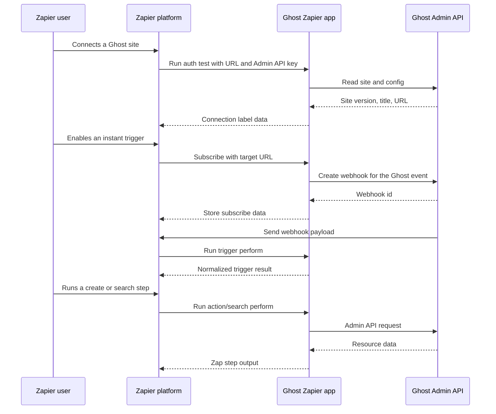

# Integration map

This repo is the code for Ghost's public Zapier integration. It is a Zapier
Platform CLI app: Zapier runs the app, users connect a Ghost site, and the app
talks to that site through the Ghost Admin API and Ghost webhooks.

The current app supports Ghost 6 and later. The compatibility floor and the
Admin API `Accept-Version` header live together in `app/lib/utils.js`.

## User-facing surface

Triggers are instant REST hooks. When a user turns on a Zap, Zapier calls the
trigger's subscribe function, this app creates a webhook in Ghost, and Ghost
sends matching events back to Zapier.

Public triggers:

- Member Created
- Member Deleted
- Member Updated
- Page Published
- Post Published
- Post Scheduled

Hidden triggers used as dynamic dropdown providers:

- Author Created
- Newsletter Created
- Tag Created
- Tier Created

Creates call the Admin API directly:

- Create Member
- Update Member
- Create Post

Searches call the Admin API directly and return an empty result on a Ghost 404:

- Find an Author, by email address or slug
- Find a Member, by email address

Subscriber actions and searches are gone from the current app. Older Zapier
integration versions may still have them, but new work should use the member
surface.

## How requests flow

## Code paths

`app/index.js` wires the Zapier app together. It imports authentication,
triggers, creates, and searches, then exposes the installed package version
and `zapier-platform-core` version for upload.

`app/authentication.js` validates new connections. It reads the site endpoint,
checks the Ghost version against `SUPPORTED_GHOST_VERSION`, then reads config
with the supplied Admin API key so a site that exposes public config cannot
pass auth with a bad key. The connection label uses the Ghost site URL, not a
secret.

`app/lib/utils.js` builds the Admin API client. It adds this app's user agent,
uses the unversioned Admin API with the Ghost 6 `Accept-Version` header, maps
Ghost validation and not-found errors to Zapier halted errors, and grafts a
browse-only `tiers` resource onto `@tryghost/admin-api` because version
`1.14.10` does not expose tiers.

`app/lib/webhooks.js` owns webhook subscription and unsubscription. It derives
the Ghost integration id from the Admin API key, then creates or deletes the
webhook through the Admin API.

Each trigger lives in `app/triggers/`. Public triggers and hidden dropdown
providers share the same REST-hook shape. Most use a real `performList` call
so Zapier can test the step or fill a dropdown without waiting for a fresh
webhook. `member_updated` is the exception: it returns a static sample payload
because Ghost's `member.edited` webhook includes a `current` object and a
partial `previous` object, and there is no useful equivalent API read that can
produce the same shape.

The hidden `author_created`, `tag_created`, `newsletter_created`, and
`tier_created` triggers provide dynamic dropdown data. `tier_created` lists
active paid tiers through the grafted tiers resource.

Creates live in `app/creates/`. Member create/update both handle single-site
and multi-newsletter sites, labels, and complimentary subscriptions. The
newer complimentary tier fields are mutually exclusive with the deprecated
default-tier field, and the code halts the Zap instead of guessing when a user
sets conflicting inputs.

## Complimentary members

The current member actions let Zap users manage complimentary access more
precisely than the old `comped` boolean allowed. Create Member and Update
Member both expose `Complimentary tier`, which assigns the member to a
specific active paid tier. Update Member also exposes `Remove complimentary
subscriptions`, which sends an empty `tiers` array to Ghost and removes the
member's complimentary tier assignments.

The older `Complimentary premium plan` field still exists for existing Zaps,
but it is deprecated. It can only add or remove the site's default
complimentary tier and it still depends on the legacy Ghost `comped` behavior.
Do not combine it with the newer tier-specific fields; the app returns a
halted error instead of guessing which complimentary path should win.

One Ghost edge case is deliberate: on sites without Stripe connected, Ghost
can attach or detach tiers but may not immediately recalculate the member's
status. The Zapier field help text calls that out because the API result can
look surprising even though the tier assignment changed.

Searches live in `app/searches/`. Member search filters by email. Author
search reads by either email address or slug.

## Product notes

The member triggers are the easiest place to surprise users. `Member Created`
fires for the Ghost `member.added` event. `Member Updated` fires for
`member.edited`, which can happen several times during a paid signup or a
subscription change. That behavior is accurate to Ghost's webhook model, but
it can make a Zap run more often than a user expects.

The sample objects in `app/` are part of the Zap editor experience. Keep them
close to real Ghost 6 API shapes, especially for webhook triggers where Zapier
uses sample and polling data during setup.

There is still room to add more Ghost resources. The current app has no public
search or create surface for tiers, newsletters, offers, recommendations, or
similar membership objects. If a feature needs one, add it deliberately with
e2e coverage against a real Ghost rather than treating a hidden
dynamic-dropdown provider as a public search.
