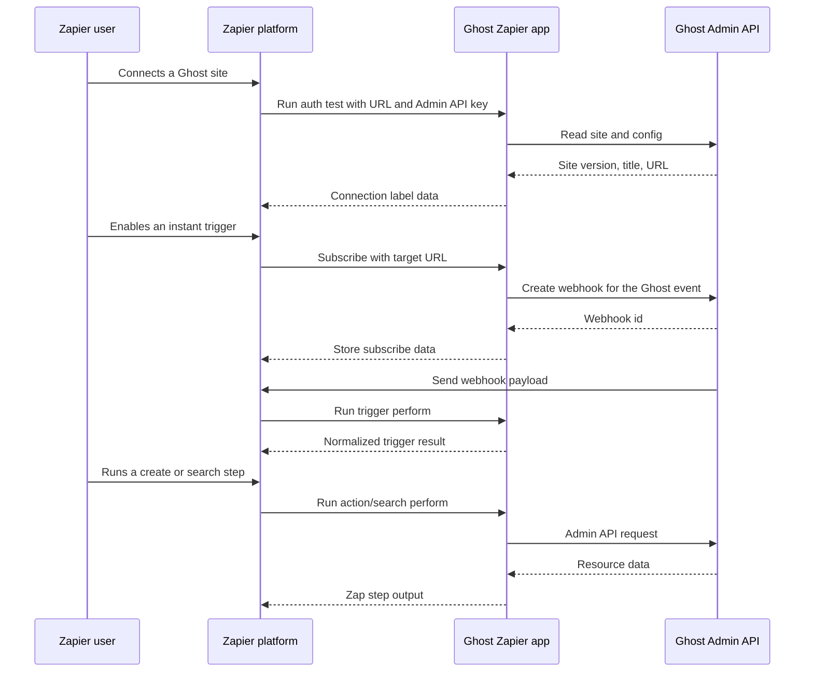

# Integration map

This repo is the code for Ghost's public Zapier integration. It is a Zapier
Platform CLI app: Zapier runs the app, users connect a Ghost site, and the app
talks to that site through the Ghost Admin API and Ghost webhooks.

The current app supports Ghost 6 and later. The compatibility floor and the
Admin API `Accept-Version` header live together in `app/lib/utils.js`.

## User-facing surface

Triggers are instant REST hooks. When a user turns on a Zap, Zapier calls the
trigger's subscribe function, this app creates a webhook in Ghost, and Ghost
sends matching events back to Zapier.

Public triggers:

- Member Created
- Member Deleted
- Member Updated
- Page Published
- Post Published
- Post Scheduled

Hidden triggers used as dynamic dropdown providers:

- Author Created
- Newsletter Created
- Tag Created
- Tier Created

Creates call the Admin API directly:

- Create Member
- Update Member
- Create Post

Searches call the Admin API directly and return an empty result on a Ghost 404:

- Find an Author, by email address or slug
- Find a Member, by email address

Subscriber actions and searches are gone from the current app. Older Zapier
integration versions may still have them, but new work should use the member
surface.

## How requests flow

```mermaid
sequenceDiagram
    participant User as Zapier user
    participant Zapier as Zapier platform
    participant App as Ghost Zapier app
    participant Ghost as Ghost Admin API

    User->>Zapier: Connects a Ghost site
    Zapier->>App: Run auth test with URL and Admin API key
    App->>Ghost: Read site and config
    Ghost-->>App: Site version, title, URL
    App-->>Zapier: Connection label data

    User->>Zapier: Enables an instant trigger
    Zapier->>App: Subscribe with target URL
    App->>Ghost: Create webhook for the Ghost event
    Ghost-->>App: Webhook id
    App-->>Zapier: Store subscribe data

    Ghost->>Zapier: Send webhook payload
    Zapier->>App: Run trigger perform
    App-->>Zapier: Normalized trigger result

    User->>Zapier: Runs a create or search step
    Zapier->>App: Run action/search perform
    App->>Ghost: Admin API request
    Ghost-->>App: Resource data
    App-->>Zapier: Zap step output
```

## Code paths

`app/index.js` wires the Zapier app together. It imports authentication,
triggers, creates, and searches, then exposes the installed package version
and `zapier-platform-core` version for upload.

`app/authentication.js` validates new connections. It reads the site endpoint,
checks the Ghost version against `SUPPORTED_GHOST_VERSION`, then reads config
with the supplied Admin API key so a site that exposes public config cannot
pass auth with a bad key. The connection label uses the Ghost site URL, not a
secret.

`app/lib/utils.js` builds the Admin API client. It adds this app's user agent,
uses the unversioned Admin API with the Ghost 6 `Accept-Version` header, maps
Ghost validation and not-found errors to Zapier halted errors, and grafts a
browse-only `tiers` resource onto `@tryghost/admin-api` because version
`1.14.10` does not expose tiers.

`app/lib/webhooks.js` owns webhook subscription and unsubscription. It derives
the Ghost integration id from the Admin API key, then creates or deletes the
webhook through the Admin API.

Each trigger lives in `app/triggers/`. Public triggers and hidden dropdown
providers share the same REST-hook shape. Most use a real `performList` call
so Zapier can test the step or fill a dropdown without waiting for a fresh
webhook. `member_updated` is the exception: it returns a static sample payload
because Ghost's `member.edited` webhook includes a `current` object and a
partial `previous` object, and there is no useful equivalent API read that can
produce the same shape.

The hidden `author_created`, `tag_created`, `newsletter_created`, and
`tier_created` triggers provide dynamic dropdown data. `tier_created` lists
active paid tiers through the grafted tiers resource.

Creates live in `app/creates/`. Member create/update both handle single-site
and multi-newsletter sites, labels, and complimentary subscriptions. The
newer complimentary tier fields are mutually exclusive with the deprecated
default-tier field, and the code halts the Zap instead of guessing when a user
sets conflicting inputs.

## Complimentary members

The current member actions let Zap users manage complimentary access more
precisely than the old `comped` boolean allowed. Create Member and Update
Member both expose `Complimentary tier`, which assigns the member to a
specific active paid tier. Update Member also exposes `Remove complimentary
subscriptions`, which sends an empty `tiers` array to Ghost and removes the
member's complimentary tier assignments.

The older `Complimentary premium plan` field still exists for existing Zaps,
but it is deprecated. It can only add or remove the site's default
complimentary tier and it still depends on the legacy Ghost `comped` behavior.
Do not combine it with the newer tier-specific fields; the app returns a
halted error instead of guessing which complimentary path should win.

One Ghost edge case is deliberate: on sites without Stripe connected, Ghost
can attach or detach tiers but may not immediately recalculate the member's
status. The Zapier field help text calls that out because the API result can
look surprising even though the tier assignment changed.

Searches live in `app/searches/`. Member search filters by email. Author
search reads by either email address or slug.

## Custom fields

A Ghost site can define custom fields to collect about its members, such as
a company name or a shipping address. `app/lib/custom_fields.js` reads the
site's definitions through a browse-only `memberMetafields` resource grafted
onto the Admin API client, and turns them into inputs for Create Member and
Update Member and into labelled outputs for Find a Member, Member Created and
Member Updated.

Ghost groups member fields into namespaces, and the fields a publisher defines
are the `custom` namespace. The app works the same way for any namespace, but
only offers `custom` for now. Ghost decides which namespaces an integration may
read and write, so once Ghost can list them for an integration, the app's
namespace list comes from Ghost.

Every input and output key is the value's path in Ghost's member payload,
`metafields.<namespace>.<key>[.<part>]`, joined with `__`, which is how Zapier
flattens nested output. An input's key therefore matches the output a later
step maps it from. Ghost never changes a field's key after creating it, so
renaming a field in Ghost relabels a Zap without breaking its mappings. These
keys are a contract with every Zap built on them: do not change them.

Member Updated also labels what an edit replaced. When an edit changes any
custom field, Ghost's `member.edited` payload has `previous.metafields` with
everything the member held before the edit, so the trigger offers each field
twice: under `current__`, and under `previous__` labelled "(before)". An edit
that changes no custom field has no `previous.metafields`.

A member with no values has no `metafields` key at all, so a Zap sees those
outputs as empty.

Which types exist, what each is made of and the type of value each part holds
come from Ghost's own `@tryghost/metafield-types` package, so the app keeps no
copy of them. An address is entered part by part, each part labelled from its
key, and a country is picked from Ghost's list of country codes. A type the
installed package doesn't know, which a site on a newer Ghost can have, is left
out until the package is updated; updating it is all a new type needs, because
every type is drawn from the package. Types never change once Ghost ships them,
so a newer package never offers a site a part it can't store.

Blank inputs are dropped before the request. Zapier passes an empty string for
a mapped value that turned out empty, and Ghost reads an empty string as
clearing a field, so sending it would wipe a value the member already had.

The app detects what the connected Ghost supports from how it answers, never
from its version:

- A Ghost without custom fields answers the definitions request with a 404,
  and one from before integrations could read them with a 403. Both mean no
  custom field inputs; the step still works.
- Member browse only includes values when asked with `include=metafields`. A
  Ghost that does not know that include ignores it.
- A Ghost from before custom fields drops them from a new member silently.
  Create Member compares what it sent with the member Ghost returns and stops
  the Zap with the reason instead of reporting success.
- A Ghost with custom fields, but from before members could be created with
  their values, refuses the whole request. The Zap stops with Ghost's own
  message, which says to create the member first and then set the values.

## Product notes

The member triggers are the easiest place to surprise users. `Member Created`
fires for the Ghost `member.added` event. `Member Updated` fires for
`member.edited`, which can happen several times during a paid signup or a
subscription change. That behavior is accurate to Ghost's webhook model, but
it can make a Zap run more often than a user expects.

The sample objects in `app/` are part of the Zap editor experience. Keep them
close to real Ghost 6 API shapes, especially for webhook triggers where Zapier
uses sample and polling data during setup.

There is still room to add more Ghost resources. The current app has no public
search or create surface for tiers, newsletters, offers, recommendations, or
similar membership objects. If a feature needs one, add it deliberately with
e2e coverage against a real Ghost rather than treating a hidden
dynamic-dropdown provider as a public search.
